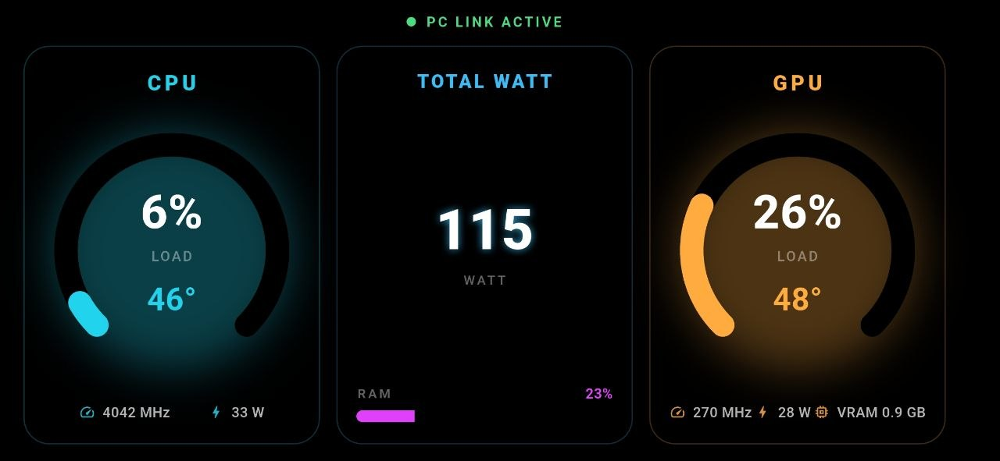
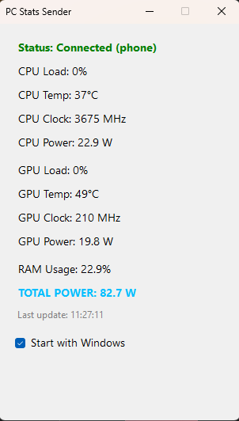

# PC Stats Monitor 🖥️📱

Turn your Android phone into a dedicated, real-time hardware monitoring dashboard for your Windows PC! This system streams live CPU/GPU load, temperatures, clocks, power, and RAM metrics directly to your device via a secure, ultra-low latency USB connection.

The entire system operates as an autonomous **Zero-Touch Automation Engine**. Once configured, you never need to touch your phone, tap any interfaces, or manage active windows—the software syncs completely with your PC's power and lock states.

---

## 📸 Screenshots & Media Gallery

| Mobile Display UI | Desktop Control Panel |
| :---: | :---: |
|  |  |

---

## 🚀 Step 1: Download the Packages

No external web pages or installation wizards are required. You can download the ready-to-run packages directly from this repository using the quick links below:

* 📱 **[Download Mobile App Package (.APK.ZIP)](./assets/pc_stats_monitor.apk.zip)** *(Extract and install on your Android Phone)*
* 💻 **[Download Desktop Agent Package (.RAR)](./assets/DesktopStatsSender.rar)** *(Extract and run on your Windows PC)*

---

## 📱 Step 2: Android Phone Configuration (Done Once)

Because this application bridges low-level hardware data directly over USB, your phone needs minor permission adjustments to establish the communication tunnel:

### 1. Enable Developer Mode & USB Debugging
1. Open your smartphone's **Settings** menu and navigate to **About Phone** (or *System Info*).
2. Locate the **Build Number** (Derleme Numarası) and tap it continuously **7 times** until a prompt appears stating: *"You are now a developer!"*.
3. Go back to the main Settings screen, search for **Developer Options** (Geliştirici Seçenekleri), enter the menu, and switch **ON** the **USB Debugging** (USB Hata Ayıklama) toggle.

### 2. Install and Trust the Mobile App
1. Extract the downloaded `pc_stats_monitor.apk.zip` and transfer the `.apk` file to your phone (or extract it directly on the device).
2. Tap the file to initiate the package installer.
3. **Security Exemption Pop-up:** Android will trigger a *"Blocked by Play Protect"* or *"Unknown App"* warning because the binary is compiled outside the official Google Play Store ecosystem.
4. Click **"More Details"** (Daha fazla detay) on the pop-up warning, then tap **"Install Anyway"** (Yine de yükle).
5. Open the app once, connect your device to the PC using a solid USB data sync cable, and check the box for *"Always allow USB debugging from this computer"* when prompted on your screen.

---

## 💻 Step 3: Windows PC Setup & Set-and-Forget

### 1. Extract the Distribution Layout
1. Extract the contents of `DesktopStatsSender.rar` into a secure directory of your choice on your local machine.
2. **The Infrastructure Rule:** You will notice a `platform-tools` directory sitting adjacent to the main execution binary `PCStatsSender.exe`. **Do not move, rename, or separate the platform-tools folder from the .exe!** The desktop agent requires this structural layout to spawn child ADB processes.

```text
📂 PC_Stats_Sender_Distribution/
├── 📂 platform-tools/             <-- Native Android SDK binaries (Do not modify!)
└── 📄 PCStatsSender.exe           <-- Unified Core Engine Binary